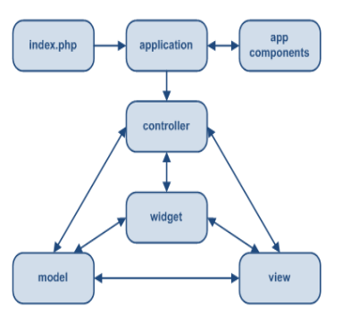
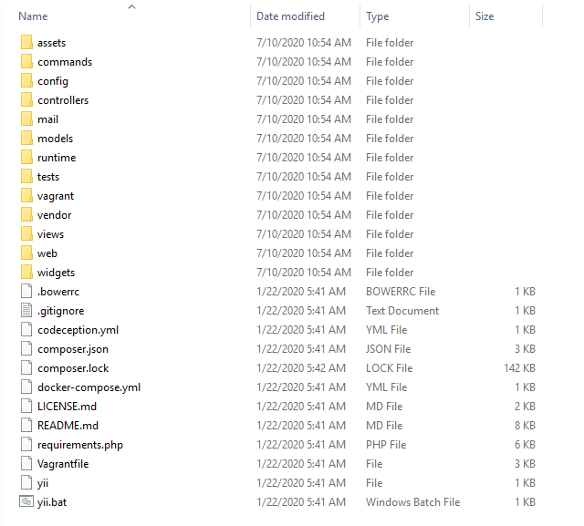
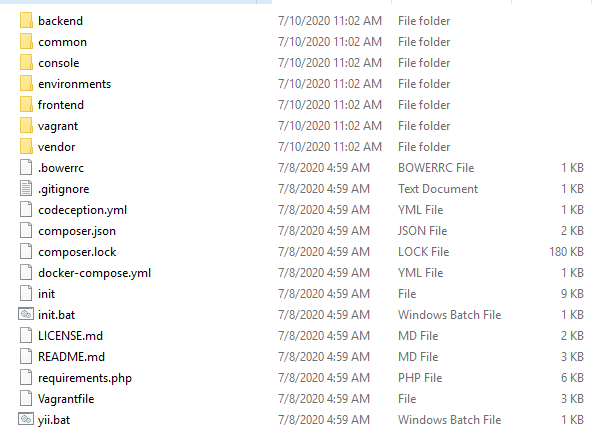

Created by Sasmitoh Rahmad Riady 
[www.ngodingstudyclub.org](http://ngodingstudyclub.org/)

# Apa itu YII?

* Yii2 merupakan PHP framework berperforma tinggi untuk pengembangan aplikasi web berskala besar dengan cepat.
* Dengan Yii2 memungkinkan proses pengembangan aplikasi web menjadi jauh lebih cepat.
* Dengan Yii2 memungkinkan proses pengembangan aplikasi web menjadi jauh lebih cepat.
* Nama Yii merupakan singkatan dari “Yes It Is”.
* Is it fast? ... Is it secure? ... Is it professional? ... Is it right for my next project? Yes, It Is

# Model View Controller [MVC]

* Yii2 merupakan framework yang menggunakan konsep MVC 
* Model merepresentasikan data beserta aturanaturan mainnya. 
* View berisi elemen-elemen yang digunakan untuk berinteraksi dengan user, seperti: teks, form masukan, dll. 
* Controller merupakan agen yang bertugas mengelola komunikasi antara model dan view 
* Yii juga mengaplikasikan front-controller yang disebut Application. Front-controller ini bertugas untuk menerima request dari user dan meneruskannya ke controller yang sesuai

# Kebutuhan

* Untuk menjalankan aplikasi yang dikembangkan menggunakan Yii2, anda membutuhkan sebuah web server yang mendukung PHP minimal versi versi 5.4.0 
* Yii2 adalah framework yang murni menggunakan konsep Object Oriented Programming (OOP), sehingga pengetahuan tentang OOP akan sangat membantu bagi pengembang aplikasi dalam memanfaatkan Yii2 framework

# Struktur Folder

## Basic

## Advanced
