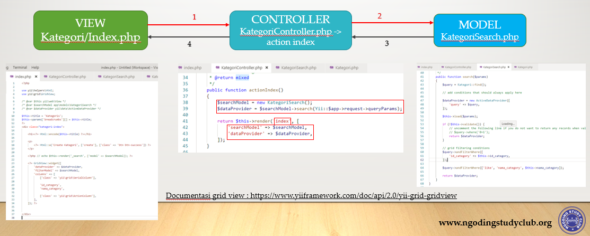

# Model View Controller
Yii mengimplementasikan pola desain model-view-controller (MVC), yang diadopsi secara luas dalam pemrograman Web. MVC bertujuan untuk memisahkan logika bisnis dari pertimbangan antar muka pengguna agar para pengembang bisa lebih mudah mengubah setiap bagian tanpa mempengaruhi yang lain. Dalam MVC, model menggambarkan informasi (data) dan aturan bisnis view(tampilan) berisi elemen antar muka pengguna seperti teks, input form sementara controller mengatur komunikasi antar model dan view.

Selain implementasi MVC, Yii juga memperkenalkan front-controller(controller-depan), yang disebut Aplikasi, yang mengenkapsulasi konteks eksekusi untuk memproses sebuah request. `Aplikasi` mengumpulkan beberapa informasi mengenai request pengguna dan kemudian mengirimnya ke controller yang sesuai untuk penanganan selanjutnya.

Diagram berikut memperlihatkan struktur statis sebuah aplikasi Yii: 

# Alur kerja Umum
Diagram berikut memperlihatkan alur kerja umum sebuah aplikasi Yii saat menangani permintaan pengguna:

1. Pengguna membuat permintaan dengan URL http://www.example.com/index.php?r=post/show&id=1 dan server Web menangani permintaan dengan menjalankan skrip bootstrap `index.php`.
2. Skrip bootstrap membuat sebuah instance Aplikasi dan menjalankannya.
3. Aplikasi mendapatkan rincian informasi permintaan pengguna dari komponen aplikasi bernama `request`.
4. Aplikasi menentukan controller dan aksi yang diminta dengan bantuan komponen aplikasi bernama `urlManager`. Dalam contoh ini, controller adalah `post` yang merujuk pada kelas `PostController`; dan aksi adalah `show` yang arti sebenarnya ditentukan oleh controller.
5. Aplikasi membuat instance controller yang diminta untuk selanjutnya menangani permintaan pengguna. Controller menentukan aksi `show` merujuk pada sebuah metode bernama `actionShow` dalam kelas controller. Kemudian membuat dan menjalankan filter (contoh kontrol akses, pengukuran) terkait dengan aksi ini. Aksi dijalankan jika diijinkan oleh filter.
6. Aksi membaca `Post` model di mana ID adalah `1` dari database.
7. Aksi meyiapkan view(tampilan) bernama `show` dengan model `Post`.
8. View membaca dan menampilkan atribut model `Post`.
9. View menjalankan beberapa widget.
10. View menyiapkan hasil yang dipasangkan dalam layout(tata letak).
11. Aksi mengakhiri pembuatan view dan menampilkan hasil akhir kepada pengguna.

# Cara kerja menampilkan indexdalam konsep MVC
Berikut ini cara kerja dalam menampilkan index di dalam sebuah konsep MVC dengan contoh view Kategori

# Cara Kerja `Create` Kategori dalam konsep MVC
Berikut ini adaah cara kerja `create` atau `simpan` dalam konsep MVC dengan contoh view categori

