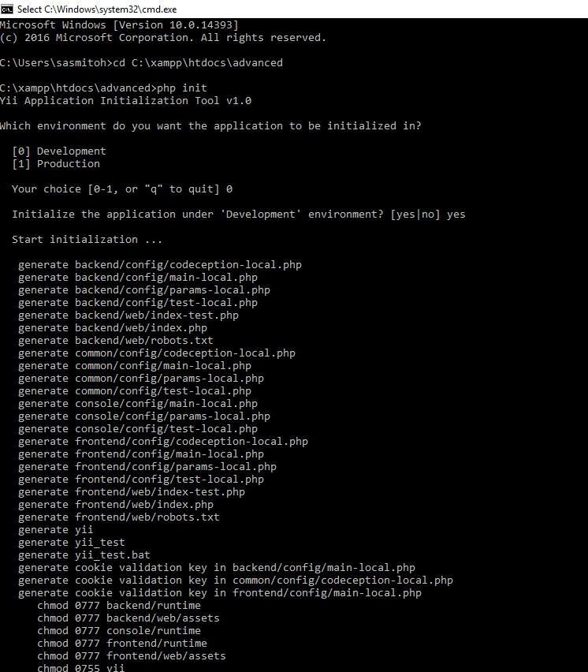
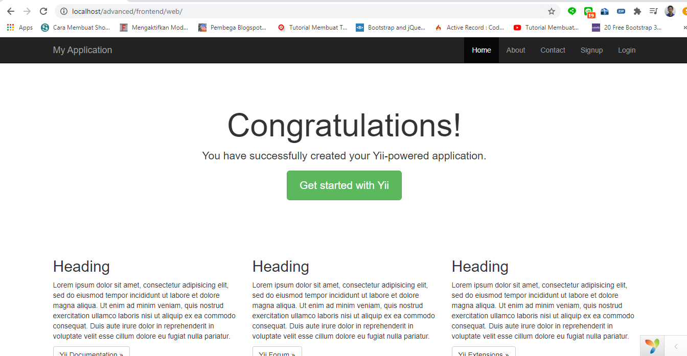
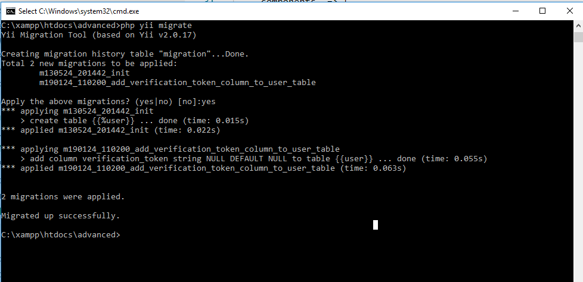
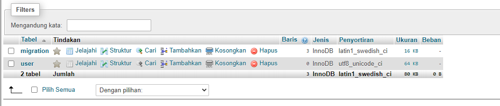
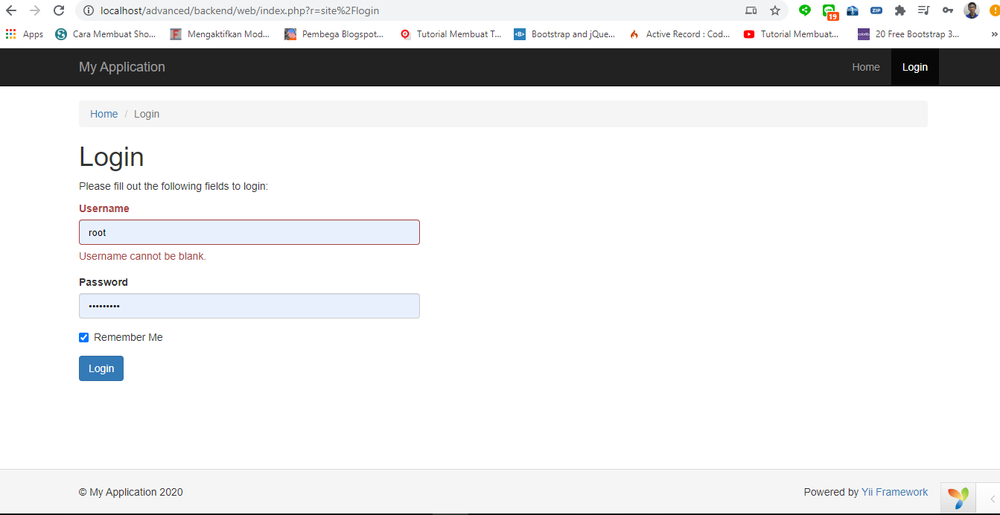

# Install YII2 Advanced

## Persiapan Kebutuhan

* Download Template yii advanced di link berikut ini [https://www.yiiframework.com/download](https://www.yiiframework.com/download)
* Download Composer di link berikut ini [https://getcomposer.org/download/](https://getcomposer.org/download/)

## Install

* Extract template yii2 advanced yang sudah di dowload
* Pindahkan hasil extact kedalam htdoc
* Jalankan command prompt yang merujuk kedalam directory template yii2 advanced `cd C:\xampp\htdocs\advanced`
* Masukan command `php init` lalu pilih `0` sebagai Development dan pilih `yes`

 

## Hasil

### frontend

`http://localhost/advanced/frontend/web/`


### backend

* Sebelum masuk ke `backend` buat terlebih dahulu database
* Database = `new_nsc`
* konfigurasi `common/config/main-local.php`
```
<?php
return [
    'components' => [
        'db' => [
            'class' => 'yii\db\Connection',
            'dsn' => 'mysql:host=localhost;dbname=new_nsc',
            'username' => 'root',
            'password' => '',
            'charset' => 'utf8',
        ],
        'mailer' => [
            'class' => 'yii\swiftmailer\Mailer',
            'viewPath' => '@common/mail',
            // send all mails to a file by default. You have to set
            // 'useFileTransport' to false and configure a transport
            // for the mailer to send real emails.
            'useFileTransport' => true,
        ],
    ],
];

```
* Create table user menggunkan `migrate` dengan perinta `php yii migrate`



berikut ini picture table `user` yang telah di generate oleh yii migrate



* `http://localhost/advanced/backend/web/`


