## Create Read Update Delete
Berikut ini kita akan membuat CRUD  menggunakan MODUL GII seperti pada template basic, yang pernah kita pelajari..

### step
* Membuat Desain Database baru
* membuat tabel user menggunakan `migrate` seperti pada materi `3`
* membuat CRUD menggunakan GII

### Deasain database
Buatlah desain database seperti gambar dibawah ini menggunakan `work brench`.
jika kalian tidak memiliki aplikasi `work brench` silakan download [disini](https://dev.mysql.com/downloads/workbench/)  
berikut ini adalah gambar desain database yang akan dibuat

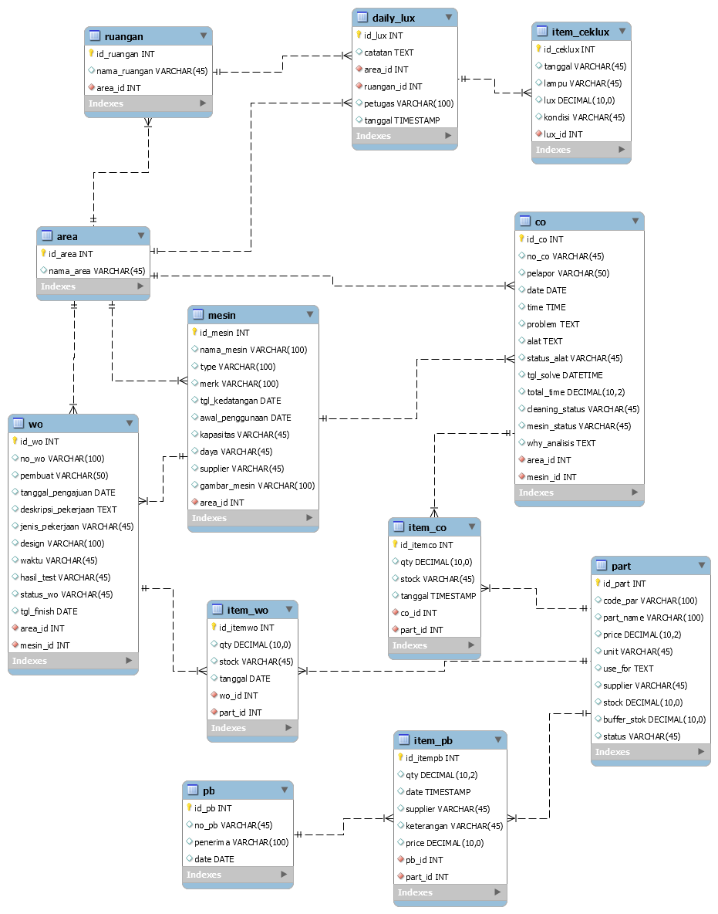

Berikut ini link download desain yang sudah saya siapkan, *hmmm... zaman milenial... (jika kalian  malas desain database) [disini](https://drive.google.com/file/d/1mdP6Z12ttIufC5GUaaR7wPg4marWnyQr/view?usp=sharing)

lalu generate kedalam `phpmyadmin`, berikut tampilanya 

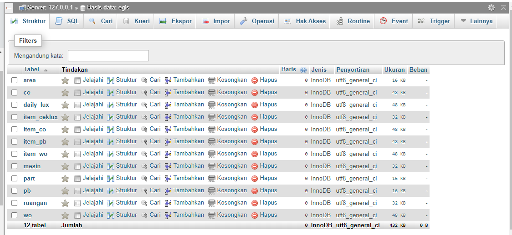

### table user
Membuat tabel user seperti yang dilakukan di materi `2`dan jangan lupa sesuaikan databasenya dengan database sekarang, di sett di bagian `main-local.php`
sehingga menghasilkan seperti ini

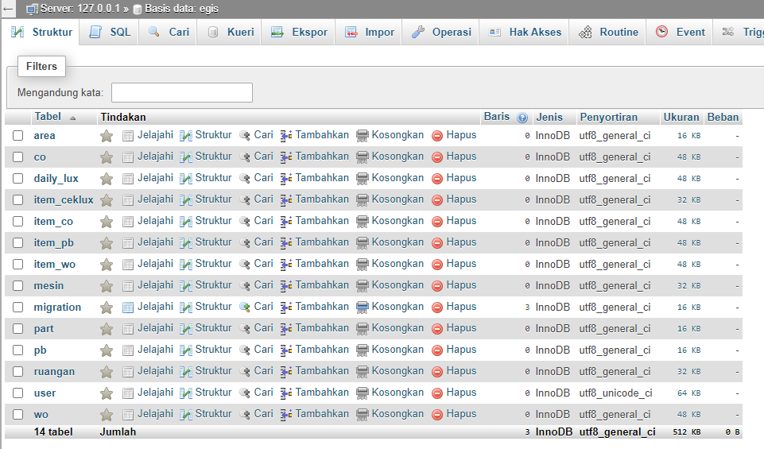

### CRUD menggunkan GII
Yang pertama akses url GII `frontend` berikut urlnya `http://localhost/advanced/frontend/web/index.php?r=gii` 

* Model Generator

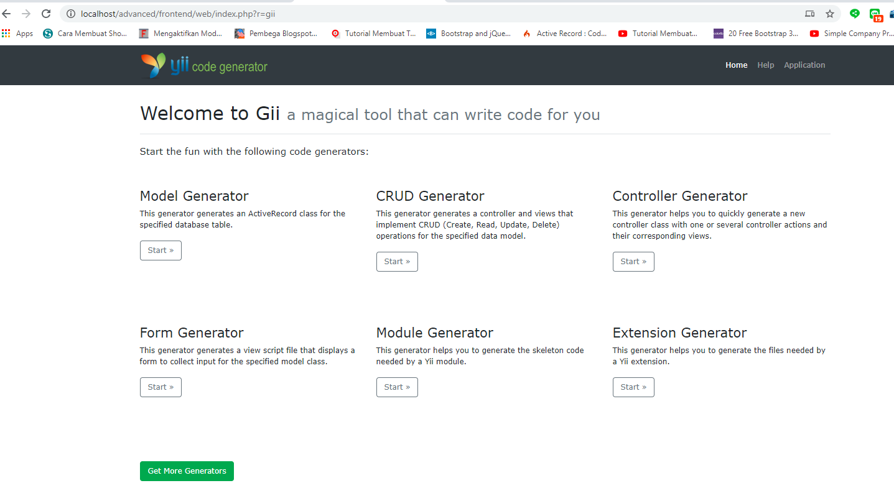

klik button `start` untuk modul generator, berikut tampilannya

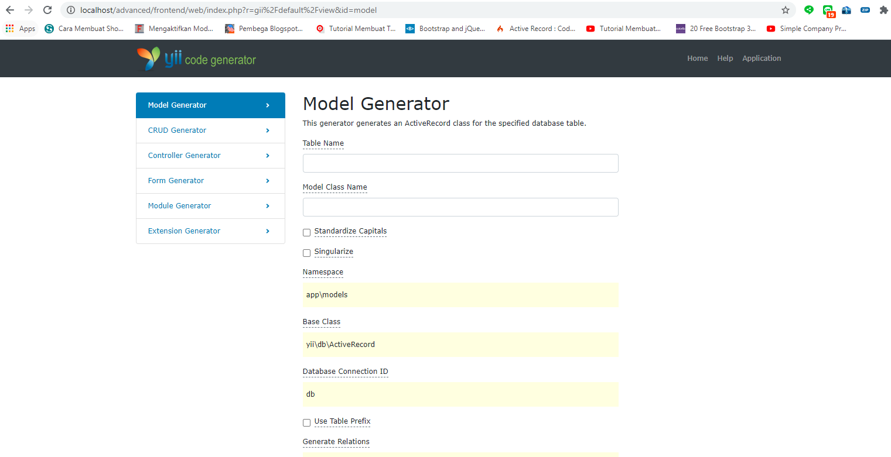

setelah ini inputkan `table name` yang akan di gerate menggunakan genarator lalu klik `preview`

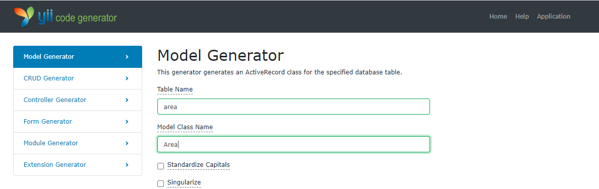

klik button review sehingga menghasilkan seperti berikut

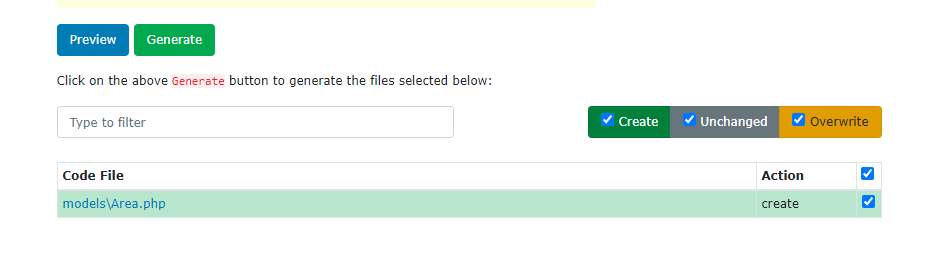

lalu generate sehingga menghasilkan seperti berikut

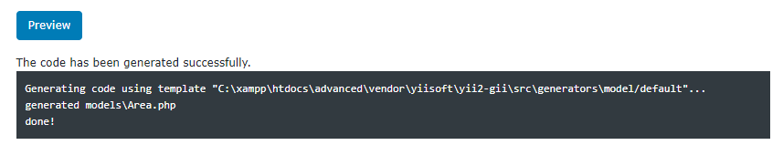

* CRUD Generator

inputkan model dan controller seperti di gambar dibawah ini

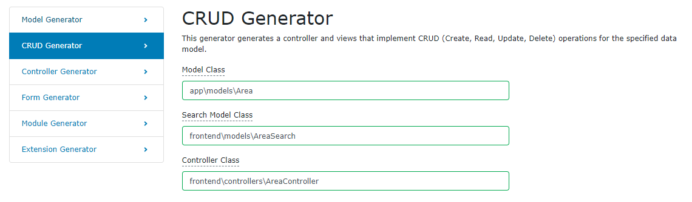

lalu tekan button `preview` seperti gambar berikut

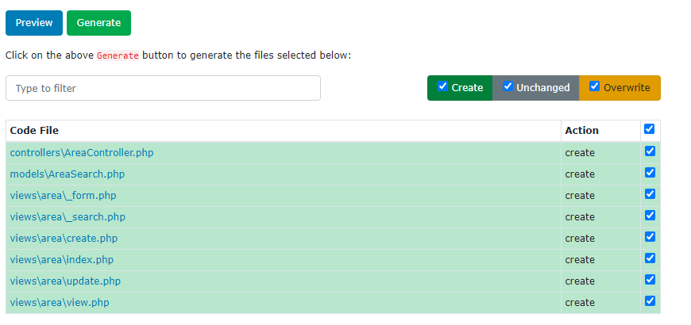

hasil generator crud

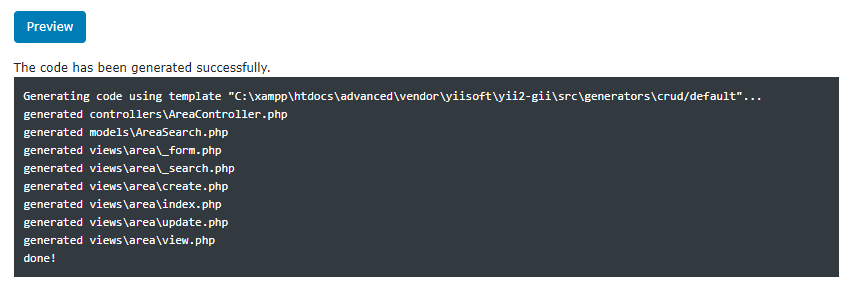

* Hasil

 Berikut hasilnya dengan mengakses url: `http://localhost/advanced/frontend/web/index.php?r=area`

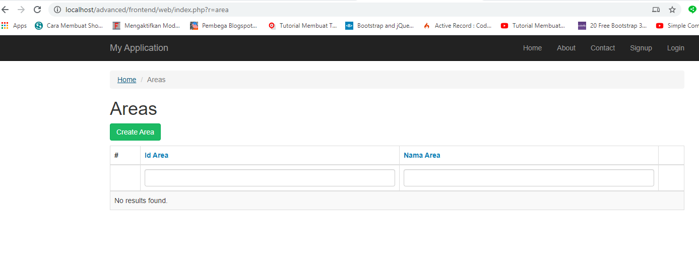

<b>NOTE:</b> lakukan langkah seperti diatas di setiap tabel lalu buat juga model untuk bagian `backend`