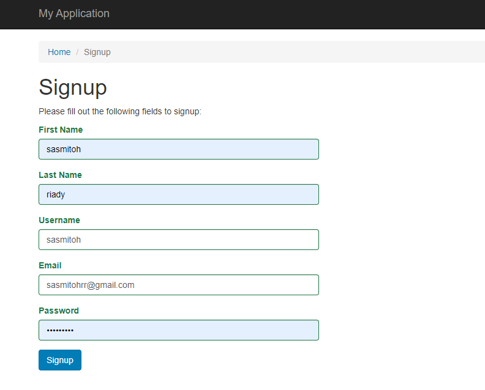
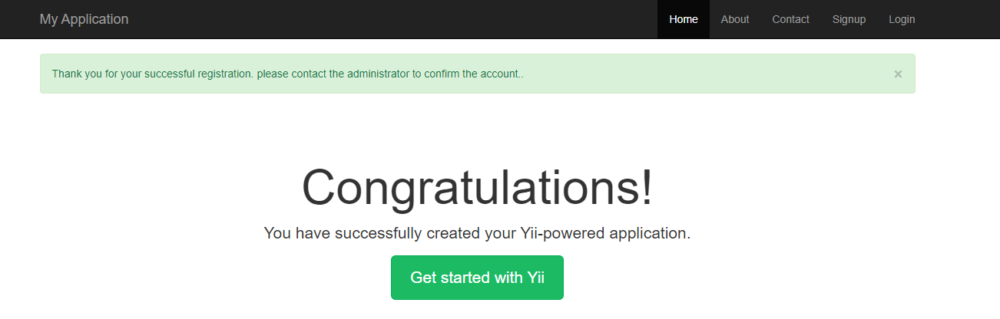

## Modifikasi Sign Up Frontend
Pada bagian sebelumnya kita telah mencoba menggunakan form SignUp untuk melakukan registrasi. Dibagian ini kita akan memodifikasi form tersebut dengan menambahkan First Name dan Last Name.

Berikut ini langkah yang akan kita lakukan 
1. Tambahkan kolom `First Name` dan `Last Name` pada `tabel user` dengan `varchar(100)`.

2. Modifikasi file `SignUpForm.php` yang berada di folder `/advanced/frontend/models` dengan menambahkan variable `public first_name` dan `last_name`, serta modifikasi pada `function rules()`. berikut contoh codenya.

```
...

class SignupForm extends Model
{
    public $username;
    public $email;
    public $password;
    public $first_name;
    public $last_name;

....
```

Tambahkan rule `first name` dan `last name` dan beri status required yang berartikan bahwa variable tersebut wajib di isi berikut contoh code-nya

```
... 

public function rules()
    {
        return [
            ['username', 'trim'],
            ['username', 'required'],
            ['first_name', 'required'],
            ['last_name', 'required'],
            ['username', 'unique', 'targetClass' => '\common\models\User', 'message' => 'This username has already been taken.'],
            ['username', 'string', 'min' => 2, 'max' => 255],

            ['email', 'trim'],
            ['email', 'required'],
            ['email', 'email'],
            ['email', 'string', 'max' => 255],
            ['email', 'unique', 'targetClass' => '\common\models\User', 'message' => 'This email address has already been taken.'],

            ['password', 'required'],
            ['password', 'string', 'min' => 6],
        ];
    }
...
```

Modifikasi `function signup()` hingga seperti berikut ini

```
...

public function signup()
    {
        if (!$this->validate()) {
            return null;
        }
        
        $user = new User();
        $user->username = $this->username;
        $user->email = $this->email;
        $user->first_name = $this->first_name;
        $user->last_name = $this->last_name;
        $user->setPassword($this->password);
        $user->generateAuthKey();
        $user->generateEmailVerificationToken();
        return $user->save() && $this->sendEmail($user);

    }

...
```

3. Modifikasi form `signup.php` yang berada di dalam folder `/advanced/frontend/views/site` dengan menambahkan input untuk `First Name` dan `Last Name`.

```
...

<div class="site-signup">
    <h1><?= Html::encode($this->title) ?></h1>

    <p>Please fill out the following fields to signup:</p>

    <div class="row">
        <div class="col-lg-5">
            <?php $form = ActiveForm::begin(['id' => 'form-signup']); ?>

                <?= $form->field($model, 'first_name') ?>
 
                <?= $form->field($model, 'last_name') ?>

                <?= $form->field($model, 'username')->textInput(['autofocus' => true]) ?>

                <?= $form->field($model, 'email') ?>

                <?= $form->field($model, 'password')->passwordInput() ?>

                <div class="form-group">
                    <?= Html::submitButton('Signup', ['class' => 'btn btn-primary', 'name' => 'signup-button']) ?>
                </div>

            <?php ActiveForm::end(); ?>
        </div>
    </div>
</div>

...
```

Berikut tampilan form SignUp yang telah di modifikasi



4. Modifikasi `alert flash` pada file `SiteController.php` pada folder `/advanced/frontend/controller` berikut code-nya dan tampilan jika berhasil register

```
...

 public function actionSignup()
    {
        $model = new SignupForm();
        if ($model->load(Yii::$app->request->post()) && $model->signup()) {
            Yii::$app->session->setFlash('success', 'Thank you for your successful registration. please contact the administrator to confirm the account..');
            return $this->goHome();
        }

        return $this->render('signup', [
            'model' => $model,
        ]);
    }

...
```

