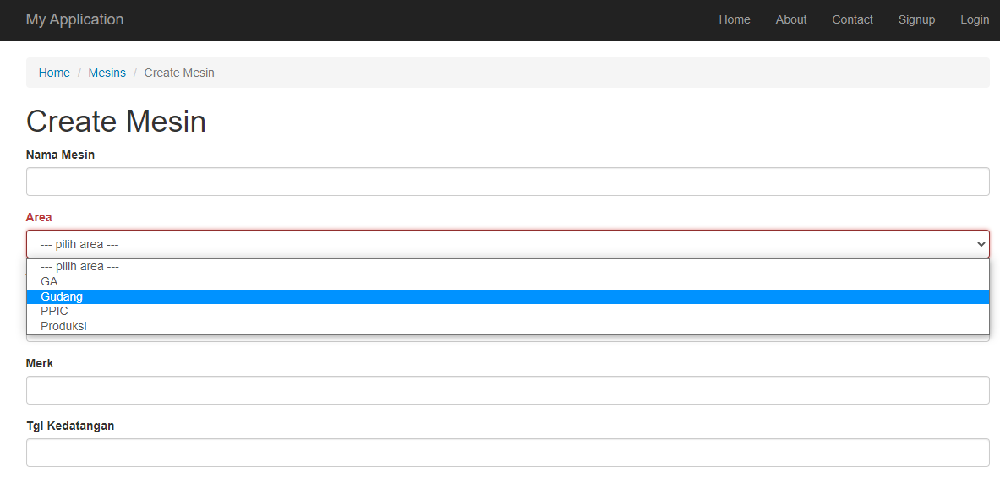

## Dropdown List pada Form
Berikut ini kita akan membuat `DropDownList` serta `Search`  berdasarkan `relationship` antar `tabel`.

1. Modifikasi `_form.php` yang berada di folder `frontend/views/mesin`:
ganti bares code berikut
```
<?= $form->field($model, 'area_id')->textInput() ?>
```
menjadi
```
<?php
        $queryArea = Area::find()->orderBy(['nama_area'=>SORT_ASC])->all();
        $dataArea = ArrayHelper::map($queryArea, 'id_area', 'nama_area');

        echo $form->field($model, 'area_id')->dropDownList($dataArea, [
            'prompt' => '--- pilih area ---'
        ]) 
?>
```

2. Tambahkan `use` di atas dengan `ArrayHelper` dan `Areas Model` seperti berikut ini.
```
use yii\helpers\ArrayHelper;
use app\models\Area;
```

3. Ubah nama field `Area ID` menjadi `Area`, buka file `Mesin.php` pada function `attributeLabel` di dalam folder `frontend/model/` seperti berikut ini
```
...
public function attributeLabels()
    {
        return [
            'id_mesin' => 'Id Mesin',
            'nama_mesin' => 'Nama Mesin',
            'type' => 'Type',
            'merk' => 'Merk',
            'tgl_kedatangan' => 'Tgl Kedatangan',
            'awal_penggunaan' => 'Awal Penggunaan',
            'kapasitas' => 'Kapasitas',
            'daya' => 'Daya',
            'supplier' => 'Supplier',
            'gambar_mesin' => 'Gambar Mesin',
            'area_id' => 'Area',
        ];
    }
...
```

4. Berikut adalah tampilan form create beserta dropdown listnya




