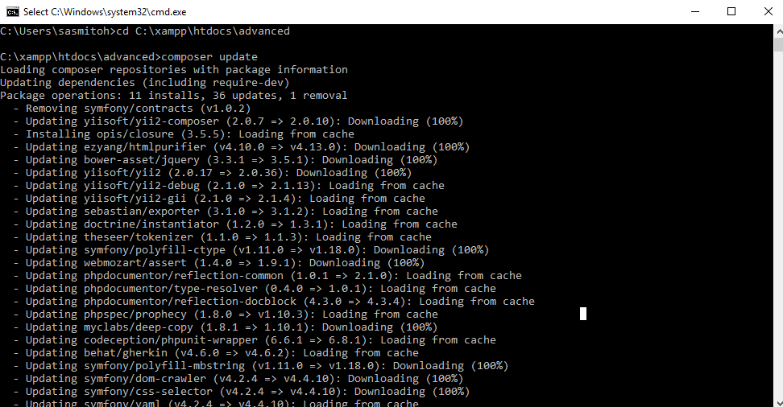
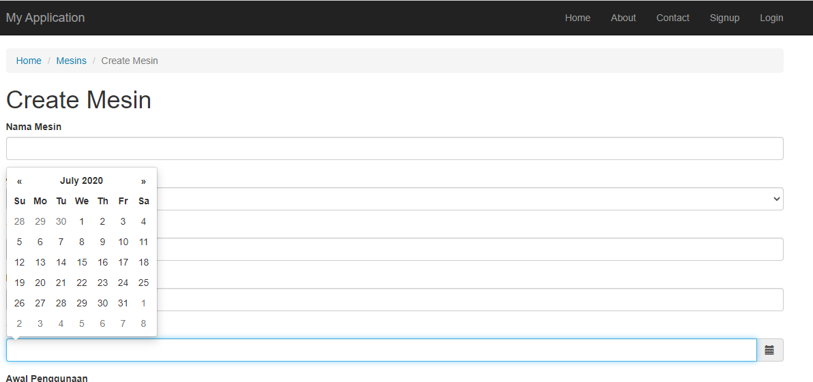

## Membuat DatePicker 
Pada bagian ini kita akan menginstall tools dari vendor untuk membuat datepicker. Tools tersebut adalah Yii2 Datepicker widget yang disediakan oleh vendor 2amigos.

1. install [Yii2 datepicker widget dari 2amigos](https://github.com/2amigos/yii2-date-picker-widget) melalui composer:
```
composer require 2amigos/yii2-date-picker-widget:~1.0
```
atau 
```
"2amigos/yii2-date-picker-widget": "~1.0"
```
kita akan menggunakan cara yang kedua yaitu dengan cara seperti berikut

buka file `composer.json` lalu tambahkan `"2amigos/yii2-date-picker-widget": "~1.0"` sperti berikut ini

```
...
"minimum-stability": "stable",
    "require": {
        "php": ">=5.4.0",
        "yiisoft/yii2": "~2.0.14",
        "yiisoft/yii2-bootstrap": "~2.0.0",
        "yiisoft/yii2-swiftmailer": "~2.0.0 || ~2.1.0",
        "2amigos/yii2-date-picker-widget": "~1.0"
    },
...
```

2. Buka `CMD` dan masukan perinta `composer update` seperti gambar di bawah ini



3. Buka file `_form.php` pada folder `frontend/views` rubah baris code berikut ini
```
<?= $form->field($model, 'tgl_kedatangan')->textInput() ?>
```

menjadi 

```
...
<?= $form->field($model, 'tgl_kedatangan')->widget(
        DatePicker::ClassName(),[
            'inline' => false,
            //'template' => '<div class="well well-sm" style="background-color: #fff; width:250px">{input}</div>',
            'clientOptions' => [
                'autoclose' => true,
                'format' => 'yyyy-m-d'

            ]

        ]
    ) 
    ?>
...
```
4. Tambahkan `2amgios` di `use` seperti berikut ini
```
use dosamigos\datepicker\DatePicker;
```

5. Berikut tampilan `datepicker` pada form `create` mesin


