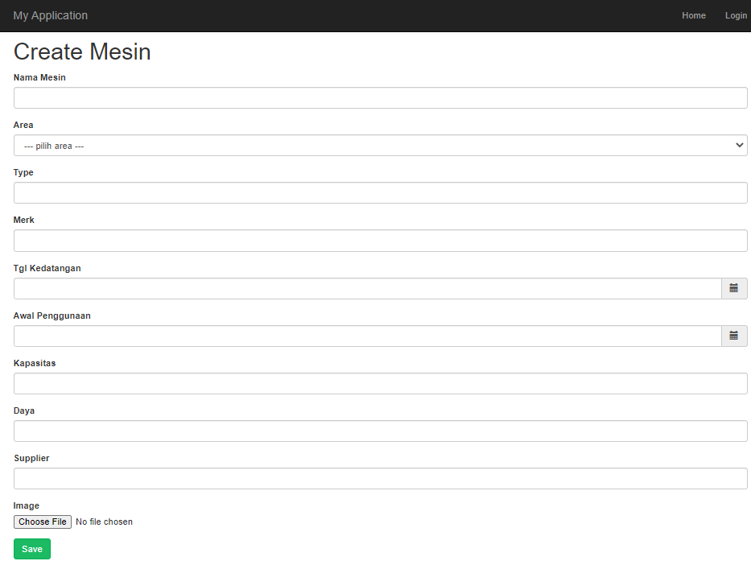
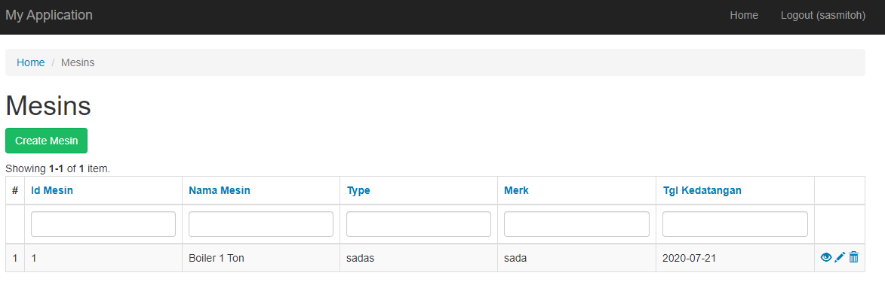
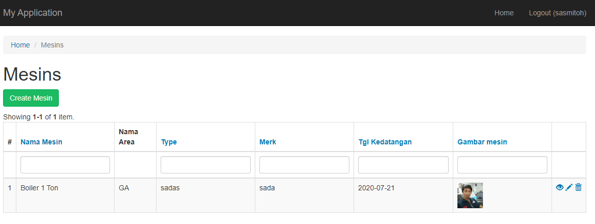
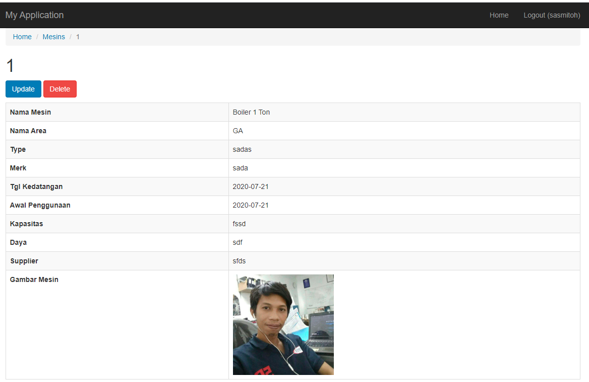

## Upload File 

Berikut ini cara upload file di yii2 advanced,  namun untuk kali ini akan di jelaskan terlebih dahulu `upload file` via `backeend`,  lakukan step 6 sampai 7 di yii `backend` untutk membuat function di page `area` dan `mesin`

1. Tambahkan `public $image` pada file `Mesin.php` yang terletak di folder `/backend/models/Mesin.php`  seperti berikut

```
...
public $image;
...
```
Tambahkan `rule` upload image pada `public function rule`
```
[
    'image', 'file', 'extensions' => ['jpg', 'png', 'JPEG', 'JPG', 'gif'],
        'wrongExtension' => 'Hanya format gambar {extensions} yang diizinkan untuk {attribute}, ',
], 
```

berikut tampilannya
```
...
public function rules()
    {
        return [
            [['tgl_kedatangan', 'awal_penggunaan'], 'safe'],
            [['area_id'], 'required'],
            [['area_id'], 'integer'],
            [['nama_mesin', 'type', 'merk', 'gambar_mesin'], 'string', 'max' => 100],
            [['kapasitas', 'daya', 'supplier'], 'string', 'max' => 45],
            [['area_id'], 'exist', 'skipOnError' => true, 'targetClass' => Area::className(), 'targetAttribute' => ['area_id' => 'id_area']],
            [
                'image', 'file', 'extensions' => ['jpg', 'png', 'JPEG', 'JPG', 'gif'],
                    'wrongExtension' => 'Hanya format gambar {extensions} yang diizinkan untuk {attribute}, ',
            ],
        ];
    }
...
```
2. Tambahkan button upload file pada `_form.php` yang terletak di folder `/backend/view/_form.php`
ubah code berikut ini 
```
<?= $form->field($model, 'gambar_mesin')->textInput(['maxlength' => true]) ?>
```
menjadi 
```
<?= $form->field($model, 'image')->FileInput() ?>
```
Berikut tampilan form `create mesin`



3. Ubah code berikut ini di file `MesinController.php` pada function `create` dan `update` pada folder `/backend/controllers/MesinController.php`

function create
```
...
 public function actionCreate()
    {
        $model = new Mesin();

        if ($model->load(Yii::$app->request->post())) {
            $gambar = UploadedFile::getInstance($model, 'image');
                if ($model->validate()) {
                    if (!empty($gambar)) {
                        $model->image = $gambar;
                        $nama_file = date('Ymdhis').'.'.$model->image->extension;
                        $lokasi_simpan = 'image/mesin';
                        FileHelper::CreateDirectory($lokasi_simpan);
                        $model->image->saveAs($lokasi_simpan.'/'.$nama_file);
                        $model->gambar_mesin = $lokasi_simpan.'/'.$nama_file;
                    }
                    $model->save(false);
                    return $this->redirect(['index']);
                }
        }

        return $this->render('create', [
            'model' => $model,
        ]);
    }
...
```

function update
```
...
 public function actionUpdate($id)
    {
        $model = $this->findModel($id);

        if ($model->load(Yii::$app->request->post())) {
            $gambar = UploadedFile::getInstance($model, 'image');
            if($model->validate()){

                if(!empty($gambar)){
                        
                    $model->image= $gambar;
                    $nama_file = date('Ymdhis').'.'.$model->image->extension;
                    $lokasi_simpan ='image/mesin';
                    FileHelper::createDirectory($lokasi_simpan);
                    $model->image->saveAs($lokasi_simpan.'/'.$nama_file);
                    $model->gambar_mesin = $lokasi_simpan.'/'.$nama_file ;
                    
                }

                $model->save(false);
                return $this->redirect(['index']);

            }
        }

        return $this->render('update', [
            'model' => $model,
        ]);
    }
...
```
jangan lupa di tambakan use `UploadedFile` dan `FileHelper`

```
...
use yii\web\UploadedFile;
use yii\helpers\FileHelper;
...
```

4. Modifikasi `index.php` untuk menampilkan gambar beserta `nama area`

before



berikut ini code modifikasi `index.php`
```
...
<?= GridView::widget([
        'dataProvider' => $dataProvider,
        'filterModel' => $searchModel,
        'columns' => [
            ['class' => 'yii\grid\SerialColumn'],

            //'id_mesin',
            'nama_mesin',
            'area.nama_area',
            'type',
            'merk',
            'tgl_kedatangan',
            [
                'attribute' => 'gambar_mesin',
                'format' => 'html',
                'label' => 'Gambar mesin',
                'value' => function ($data) {
                    return Html::img('@web/' . $data['gambar_mesin'],['width' => '50px']);
                },
    
            ],

            //'awal_penggunaan',
            //'kapasitas',
            //'daya',
            //'supplier',
            //'gambar_mesin',
            //'area_id',

            ['class' => 'yii\grid\ActionColumn'],
        ],
    ]); ?>
    ...
```
after



5. Modifikasi `view.php` 
```
...
  <?= DetailView::widget([
        'model' => $model,
        'attributes' => [
            //'id_mesin',
            'nama_mesin',
            'area.nama_area',
            'type',
            'merk',
            'tgl_kedatangan',
            'awal_penggunaan',
            'kapasitas',
            'daya',
            'supplier',
            // 'gambar_mesin',
            [
                'attribute'=>'gambar_mesin',
                'format'=>'html',
                'value'=>Html::img(Url::base().'/'.$model->gambar_mesin,['width'=>'200px'])
            ],
            //'area_id',
        ],
    ]) ?>
...
```
tambahkan use `Url`
```
use yii\helpers\Url;
```
Berikut tampilan dari view mesin


